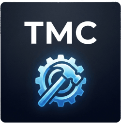

👋 Hi, I'm a *self-taught* **network**, **software**, and **systems engineer** with a strong passion for **open source**!

🙋‍♂️ My real name is **Christian**, but I often go by **Gamemann** or **WhoZ** online.

🛠️ I enjoy working with:
- 🐧 **Linux**
- 🌐 **Network engineering & security**
- 🔓 **Penetration testing**
- 💻 **Web development** & **web scraping**
- 🤖 **Bot development**
- 🎮 **Game development** & **game modding**

📁 Check out my:
-  🌐 [**Open source website portfolio**](https://cdeacon.net)
-  📄 [**Full list of open source projects**](./projects.md)

## 🚀 My Active Projects
### [ **The Modding Community**](https://moddingcommunity.com)
An inclusive **modding** and **game development** community.

- 🎮 [Apps & Games](https://moddingcommunity.com/apps)
- 🔨 [Mod Workshop](https://moddingcommunity.com/mods)
- ⚙️ [Assets](https://moddingcommunity.com/assets) (game assets & more!)
- 🌐 [Server Browser](https://moddingcommunity.com/servers)
- 📝 [Blog](https://moddingcommunity.com/blog)
- 💻 [GitHub Org](https://github.com/modcommunity)

### [ **TekWorks**](https://tekworks.net)
A **software developer** and **publisher** organization.

- 📝 [Blog](https://tekworks.net/blog)
- 💻 [GitHub Org](https://github.com/tek-works)

I strive to keep my **open source** projects updated, but as a solo developer juggling my own projects and professional work, it is hard for me to add features and address issues in a timely manner. Contributions are highly encouraged! Whether it’s a bug fix or a feature request, PRs are greatly appreciated, and all contributors will be credited in the README.

### [❤️ **I Lost My Mom To Pancreatic Cancer** ❤️](https://github.com/gamemann/i-lost-my-mom-to-pancreatic-cancer)

