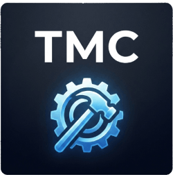

👋 Hi, I'm a *self-taught* **network**, **software**, and **systems engineer** with a strong passion for **open source**!

🙋‍♂️ My real name is **Christian**, but I often go by **Gamemann** or **WhoZ** online.

🛠️ I enjoy working with:
- 🐧 **Linux**
- 🌐 **Network engineering & security**
- 🔓 **Penetration testing**
- 💻 **Web development** & **web scraping**
- 🤖 **Bot development**
- 🎮 **Game development** & **game modding**

📁 Check out my:
-  🌐 [**Open source website portfolio**](https://cdeacon.net)
-  📄 [**Full list of open source projects**](./projects.md)

## 🚀 My Active Projects
###  [The Modding Community](https://moddingcommunity.com)
An inclusive **modding** and **game development** community. We offer a space where users can share game dev assets, mods, and track game/social servers. We are also creating our own [gaming platform](https://moddingcommunity.com/play) built on-top of [Godot](https://godotengine.org)!

- 🎮 [Apps & Games](https://moddingcommunity.com/apps)
- 🔨 [Mod Workshop](https://moddingcommunity.com/mods)
- ⚙️ [Assets](https://moddingcommunity.com/assets) (game assets & more!)
- 🌐 [Server Browser](https://moddingcommunity.com/servers)
- 📝 [Blog](https://moddingcommunity.com/blog)
- 💻 [GitHub Org](https://github.com/modcommunity)

#### Open Source Games I'm Working On
Here are *open source* games I'm working on with Godot and TMC's [Dot](https://moddingcommunity.com/co/4-dot-assets) collection. These are mostly for demonstration purposes and to show what TMC's gaming platform can do with its CDN and cross-platform play (web browser, PC/desktop app, and mobile). That said, these games are nowhere close to complete!

* [**G2gfast**](https://github.com/gamemann/game-g2gfast): A 3D-based game where players *surf* and *bunny hop* on *maps* to compete for world records. This is inspired off of Source Engine movements and Counter-Strike Surfing and Bunny Hopping.
* [**Playground**](https://github.com/gamemann/game-playground): A 3D-based game that acts as a sandbox. Players can join, spawn props, throw them around, and more. This game is inspired off of Garry's Mod.
* [**Arena**](https://github.com/gamemann/game-arena): A 3D-based game where players rack up the most points to win individually or for their team in game modes such as deathmatch, gungame, and more.
* [**Hungario**](https://github.com/gamemann/game-hungario): A 2D-based game where players start off as small monsters and must eat food and others. The largest monster wins. Inspired off of the game Agario.
* [**Buses From Hell**](https://github.com/gamemann/mg-buses-from-hell): A 3D-based game where there are one or two bus driver(s) and the rest of the players must survive. The bus driver's goal is to eliminate all players. Inspired off of a classic Counter-Strike: Source MiniGames map, [buses_from_hell](https://gamebanana.com/mods/127607).
* [**Smash Copter**](https://github.com/gamemann/mg-smash-copter): A 3D based game where all players spawn on-top of platforms being held up by a single pillar. There is a canon in the middle that launches props in the air and if they fall onto the platforms, they can make it collapse killing any player standing on top of the platform. If more than one survivor/team is alive by the time runs out, all players are teleported with guns for final death.

###  [TekWorks](https://tekworks.net)
A **software developer** and **publisher** organization.

- 📝 [Blog](https://tekworks.net/blog)
- 💻 [GitHub Org](https://github.com/tek-works)

I strive to keep my **open source** projects updated, but as a solo developer juggling my own projects and professional work, it is hard for me to add features and address issues in a timely manner. Contributions are highly encouraged! Whether it’s a bug fix or a feature request, PRs are greatly appreciated, and all contributors will be credited in the README.

### [❤️ **I Lost My Mom To Pancreatic Cancer** ❤️](https://github.com/gamemann/i-lost-my-mom-to-pancreatic-cancer)

