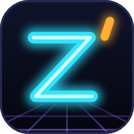

👋 Hi, I'm a *self-taught* **network**, **software**, and **systems engineer** with a strong passion for **open source**!

🙋‍♂️ My real name is **Christian**, but I often go by **Gamemann** or **WhoZ** online.

🛠️ I enjoy working with:
- 🐧 **Linux**
- 🌐 **Network engineering & security**
- 🔓 **Penetration testing**
- 💻 **Web development** & **web scraping**
- 🤖 **Bot development**
- 🎮 **Game development** & **game modding**

📁 Check out my:
-  🌐 [**Open source website portfolio**](https://cdeacon.net)
-  📄 [**Full list of open source projects**](./projects.md)

## 🚀 My Active Projects
###  [The Modding Community](https://moddingcommunity.com)
An inclusive **modding** and **game development** community. We offer a space where users can share game dev assets, mods, and track game/social servers. We are also creating our own [gaming platform](https://moddingcommunity.com/play) built on-top of [Godot](https://godotengine.org)!

- 🎮 [Apps & Games](https://moddingcommunity.com/apps)
- 🔨 [Mod Workshop](https://moddingcommunity.com/mods)
- ⚙️ [Assets](https://moddingcommunity.com/assets) (game assets & more!)
- 🌐 [Server Browser](https://moddingcommunity.com/servers)
- 📝 [Blog](https://moddingcommunity.com/blog)
- 💻 [GitHub Org](https://github.com/modcommunity)

###  [Zee's Games](https://zeesgames.com)

A collection of **open source** and *MIT-licensed* games I'm working on for [@modcommunity's](https://moddingcommunity.com/play) gaming platform built on top of [@godotengine](https://godotengine.org)! These games primarily serve as demonstrations of what the gaming platform is capable of, but I also like working on them for fun as well.

- [G2g Fast](https://zeesgames.com/g2gfast): Bunny hop and surf timer runs with Source-style movement and leaderboards.
- [Arena](https://zeesgames.com/arena): Fast first-person deathmatch with GunGame and classic Surf Deathmatch maps.
- [Playground](https://zeesgames.com/playground): A physics sandbox: spawn props, NPCs and weapons and build whatever you like.
- [Hungario](https://zeesgames.com/hungario): Steer a hungry monster, eat to grow and outlast everyone else.
- [Buses From Hell](https://zeesgames.com/buses-from-hell): Survive one or more crazy bus drivers trying to run you over.
- [Smash Copter](https://zeesgames.com/smash-copter): Stay on wobbly platforms while a cannon rains props down on you.
- [Zombie Zone](https://zeesgames.com/zombie-zone): Co-op zombie survival: escape through the city or survive waves.
- [Hide n Seek](https://zeesgames.com/hide-n-seek): Hide as yourself; every hider caught joins the hunt.
- [Prop Hunt](https://zeesgames.com/prop-hunt): Disguise as furniture and keep still while blindfolded hunters search.
- [Murder Mystery](https://zeesgames.com/murder-mystery): Everybody looks the same. One of them has a knife.
- [Deathrun](https://zeesgames.com/deathrun): Run a trap-filled course while the activators press every button they have.
- [Wipeout](https://zeesgames.com/wipeout): Obstacle courses over water: sweeper arms, big balls and a fight at the finish.
- [Dangerous Delivery](https://zeesgames.com/dangerous-delivery): Haul loads up mountain roads with no guard rails. Riskier runs pay more.
- [Look At Me](https://zeesgames.com/look-at-me): A dark house, 32 levels deep, and the witches walking its rooms.

###  [TekWorks](https://tekworks.net)
A **software developer** and **publisher** organization. As of right now, TMC is the only project under TekWorks. However, in the future we intend on creating open source security and general purpose tools!

- 📝 [Blog](https://tekworks.net/blog)
- 💻 [GitHub Org](https://github.com/tek-works)

**NOTE**: I started using Claude Code on **July 8th, 2026** due to the amount of projects I'm working on and how much code is required. Most of my open source projects' code before that time was written by me. I strive to keep my **open source** projects updated, but as a solo developer juggling my own projects and professional work, it is hard for me to add features and address issues in a timely manner. Contributions are highly encouraged! Whether it’s a bug fix or a feature request, PRs are greatly appreciated, and all contributors will be credited in the README.

### [❤️ **I Lost My Mom To Pancreatic Cancer** ❤️](https://github.com/gamemann/i-lost-my-mom-to-pancreatic-cancer)

